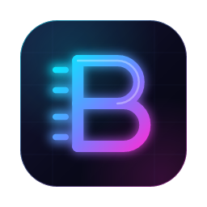

<p align="center">
  
</p>

<h1 align="center">BYTE</h1>
<p align="center"><b>A private AI assistant that runs entirely on your Mac.</b><br/>
No account. No subscription. Your conversations never leave your computer.</p>

---

## What it does today

- **Chats with a capable AI model running on your Mac's GPU** (Apple Silicon + Metal), even offline.
- **Four modes:** ⚡ Fast · 🎚 Auto · 🔭 Deep · 🚀 Extended. They set how long BYTE thinks and how thorough the answer is.
- **Visible thinking:** turn reasoning on or off per message and open "Thought for…" to see how BYTE worked it out.
- **Up to date with sources:** BYTE searches and reads the web when a question needs current information, and shows numbered, clickable citations and source cards. No account or API key needed.
- **Exact math:** a built-in calculator handles arithmetic, percentages and unit conversions.
- **Guided setup:** checks your Mac, recommends the right model, and downloads it with pause and resume. Every file is checksum-verified.
- **Memory-aware:** BYTE works out how much memory each model needs and won't run one that doesn't fit. It shrinks the context window automatically when memory is tight.
- **11 themes**, adjustable text size and density, keyboard shortcuts, and saved chat history with search.

BYTE is being built in phases. PDF/PowerPoint/Word export, file and knowledge-base reading, Mac app control, voice, and more arrive in upcoming test builds, delivered by auto-update. See [the roadmap](#roadmap).

## Requirements

| | Minimum | Recommended |
|---|---|---|
| Mac | Apple Silicon (M1 or newer) | M2 / M3 / M4 |
| Memory | 8 GB (Fast model only) | **16 GB** or more |
| macOS | 13.3 Ventura | 14 Sonoma or newer |
| Free disk | 7 GB | 12 GB |

## Install

1. Download the latest `BYTE_…_aarch64.dmg` from [Releases](../../releases).
2. Open the `.dmg` and drag **BYTE** into **Applications**.
3. **First launch.** BYTE isn't signed with a paid Apple Developer ID yet, so macOS blocks it the first time:
   - **macOS 15 Sequoia and later:** open BYTE, click **Done** on the warning, then open **System Settings → Privacy & Security**, scroll down and click **Open Anyway**. Confirm with your password or Touch ID.
   - **macOS 13–14:** right-click (or Control-click) BYTE in Applications, choose **Open**, then **Open** again.
   - If macOS says BYTE **"is damaged and can't be opened"**, run this once in Terminal, then open it normally:
     ```sh
     xattr -cr /Applications/BYTE.app
     ```
4. Follow the welcome guide. It downloads your model (about 9 GB for the recommended one) and you're ready.

> Test builds (tags like `v1.0.0-test.1`) are marked **Pre-release** on the Releases page.

## Models

BYTE has a built-in **model catalog** (Settings → Models) that checks every model against your Mac's memory and
recommends the best one. Examples of what it picks:

| Your Mac | BYTE's pick | Download |
|---|---|---|
| 8 GB | Qwen3.5 4B (Q6_K) | 3.5 GB |
| 16 GB | Qwen3.5 9B (Q6_K) | 7.5 GB |
| 32 GB | Qwen3.8 27B (Q5_K_M) | 19.8 GB |
| 96–128 GB | Qwen3.8 27B (Q6_K) or gpt-oss 120B | 22–63 GB |

The catalog lists **184 chat models with 1,003 versions** (0.4 GB to 400+ GB, 52 of them mixture-of-experts),
each labelled *Great fit*, *Fits*, or *Needs N GB*, with the **estimated tokens/sec and typical answer time on your
Mac** (BYTE detects the chip — M1 to M5, Pro/Max/Ultra — so an M4 shows faster numbers than an M2). Search, sort
(best, newest, smallest, fastest) and filter by memory size, strength, MoE or downloaded. The list itself is small
(about 0.4 MB) and refreshes from the web, so new models appear without an app update. Model files download from
Hugging Face only when you choose them, can be deleted any time, and are stored in `~/Library/Application Support/com.loganstarner.byte/models/`.

To regenerate the catalog: `node scripts/discover-models.mjs` (finds models from trusted publishers), then
`node scripts/build-catalog.mjs` (reads exact file sizes, checksums and architecture from Hugging Face without
downloading the models). Hand-picked models and quality scores live in `scripts/catalog-sources.json`.

**About the Neural Engine:** chat models run on the GPU (llama.cpp with Metal), which is the fastest path on Apple
Silicon; the Neural Engine can't run these models efficiently. BYTE will use it through Apple's frameworks for
text recognition in images (OCR) and voice.

**Honest expectations:** local models are very capable but won't match the largest cloud models at writing or
reasoning. Deep and Extended answers can take a minute or more, especially on a fanless MacBook Air.

## Privacy

- The AI model runs on your Mac. Prompts, answers, and files are processed locally.
- BYTE only uses the internet to download models (from Hugging Face), and, once web search ships, to look things up when you ask a question that needs current information.
- The built-in engine only listens on `127.0.0.1` and requires a random per-launch key, so other apps can't use it.

## Keyboard shortcuts

| Shortcut | Action |
|---|---|
| <kbd>Enter</kbd> / <kbd>Shift</kbd>+<kbd>Enter</kbd> | Send / new line |
| <kbd>⌘N</kbd> | New chat |
| <kbd>⌘,</kbd> | Settings |
| <kbd>⌘\\</kbd> | Show / hide sidebar |
| <kbd>Esc</kbd> | Stop generating |

## Troubleshooting

- **"Engine problem"**: open **Settings → Engine** to see the log and restart the engine. Out-of-memory errors mean another app is using a lot of RAM. Quit it or switch to Qwen3 8B.
- **Download stopped**: press **Resume**. BYTE continues where it left off, even after quitting.
- **Slow answers**: use **Fast** mode or turn **Thinking** off. Closing heavy apps (browsers with many tabs, video editors) frees memory bandwidth for the model.

## Roadmap

1. ✅ Foundation: built-in engine, model manager, chat, thinking, onboarding, themes
2. ✅ Web search and reading with citations, tool use, calculator
3. Encrypted chat database, memory, projects, profiles, export
4. File drop (PDF, Word, images with OCR) and personal knowledge base
5. PDF / PowerPoint / Word / web-page documents with themes and charts
6. Deep and Extended research, academic search, fact-check, compare, trip planner, YouTube
7. Writing studio, long-form writer, flashcards, quizzes, tutor, translate
8. Speed: speculative decoding, smart routing, model lab (add any GGUF)
9. Mac control: Notes, Reminders, Calendar, Mail, Messages, Music, Safari, Shortcuts, files
10. Automation: tasks, scheduler, daily briefing, page watchers, storage and battery tools
11. Voice, vision, Quick Ask, menu-bar mini chat, command palette, notes, mind maps
12. Offline switch, Touch ID lock, permission dashboard, kids mode, iCloud backup, **v1.0**

## Development

```sh
npm install
scripts/build-llama-server.sh      # builds the engine sidecar for this machine (pinned in scripts/LLAMA_TAG)
npm run tauri dev                  # run the app
```

| Task | Command |
|---|---|
| Frontend type-check / tests / build | `npm run typecheck` · `npx vitest run` · `npm run build` |
| Rust tests | `cd src-tauri && cargo test` |
| End-to-end test with a real engine | `BYTE_TEST_LLAMA_SERVER=… BYTE_TEST_MODEL=… cargo test e2e -- --ignored` |
| Set the version everywhere | `node scripts/bump.mjs 1.0.0-test.2` |
| Publish a test build | bump, commit, then `git tag v1.0.0-test.2 && git push --tags` |

**Stack:** Tauri 2 (Rust) · React 19 + TypeScript + Vite · llama.cpp (`llama-server`, Metal) · Qwen3 GGUF models.

```
src/                 React UI (components, state, design tokens and themes)
src-tauri/src/       Rust core
  engine.rs          supervises the llama-server sidecar (start, health, warm-up, restart)
  models.rs          model catalog + resumable, checksum-verified downloader
  system.rs          hardware detection and the RAM planner
  chat.rs            streaming chat (SSE), context-window fitting, cancellation
  router.rs          per-message thinking/length decisions, time-sensitive detection
  agent.rs           tool loop: forced search + auto-read, tool rounds, sources, stats
  tools/             web search (DuckDuckGo/Bing), page reader (SSRF-safe), calculator, action log
scripts/             engine build, version bump
```
